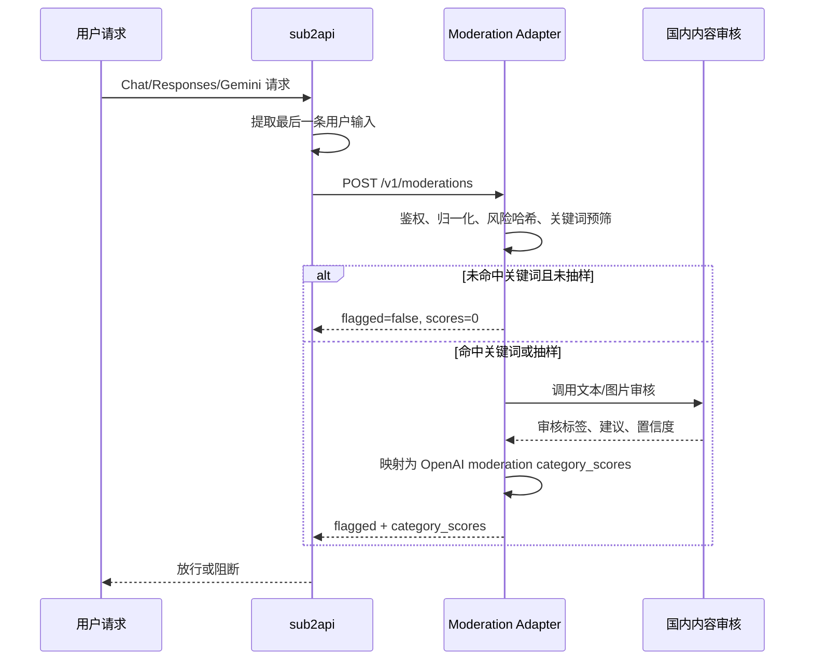

# 风控审计 Adapter 落地方案

版本：2026-07-03

## 1. 目标

在不修改 `sub2api` 后台代码的前提下，把风控中心接入到一个自建审计 Adapter：

```text
sub2api 风控中心 -> 自建 Adapter -> 国内内容审核厂商
```

Adapter 负责做关键词/规则预筛：

- 未命中关键词：Adapter 本地直接返回放行，通常只增加 1-20ms。
- 命中关键词：Adapter 再请求国内内容审核厂商，按厂商语义结果决定放行或阻断。
- 未命中抽样：对未命中内容做 1%-5% 随机送审，用于监控漏检率。

这个方案的核心价值是：让所有请求都能经过一个很轻的本地网关，但只有少量高风险请求产生外部审计费用和跨境延迟。

## 2. 当前项目约束

### 2.1 sub2api 审计调用方式

当前代码会调用：

```text
POST {base_url}/v1/moderations
Authorization: Bearer {api_key}
Content-Type: application/json
```

请求体：

```json
{
  "model": "omni-moderation-latest",
  "input": "用户输入文本"
}
```

当输入包含图片时，`input` 会变成 OpenAI moderation 风格的数组：

```json
{
  "model": "omni-moderation-latest",
  "input": [
    { "type": "text", "text": "描述这张图片" },
    { "type": "image_url", "image_url": { "url": "https://example.com/a.png" } }
  ]
}
```

相关代码：

- `backend/internal/service/content_moderation.go`
- `backend/internal/service/content_moderation_input.go`
- `frontend/src/api/admin/riskControl.ts`

### 2.2 审计内容不是完整上下文

当前实现只提取最后一条用户输入：

- OpenAI Chat：最后一条 `role=user` 的 `messages`。
- Anthropic Messages：最后一条 `role=user` 的 `messages`。
- OpenAI Responses：最后一个用户输入 item。
- Gemini：最后一个 `role=user` 或无 role 的 content。
- 图片请求：`prompt`，以及最多 1 张图片。

审计文本会做空白压缩，并截断到最多 `12000` 个字符。也就是说，成本估算不能直接按完整业务 input tokens 计算，应该按“最后一条用户输入”的实际文本量计算。

### 2.3 内置关键词模式不要用于本方案

当前后台关键词模式有三种：

- `keyword_only`：关键词命中直接阻断，未命中直接放行，不请求 API。
- `keyword_and_api`：关键词命中直接阻断，未命中请求 API。
- `api_only`：忽略后台关键词，所有被采样请求都请求 API。

本方案需要关键词命中后再做语义审核，避免“我的 app 被人逆向了”这类正常语义被关键词误杀。因此不要使用后台内置关键词直接阻断。

推荐配置：

```text
keyword_blocking_mode = api_only
blocked_keywords = 空
```

关键词写在 Adapter 内部。

### 2.4 Adapter 返回不能只写 flagged=true

sub2api 解析 moderation 响应后，最终是否命中主要看 `category_scores` 是否超过后台阈值。`flagged` 字段会被解析，但当前阻断判断不是只依赖它。

因此 Adapter 如果要触发阻断，必须把某个内置分类分数设置到阈值以上，例如：

```json
{
  "results": [
    {
      "flagged": true,
      "category_scores": {
        "harassment": 0,
        "harassment/threatening": 0,
        "hate": 0,
        "hate/threatening": 0,
        "illicit": 1,
        "illicit/violent": 0,
        "self-harm": 0,
        "self-harm/intent": 0,
        "self-harm/instructions": 0,
        "sexual": 0,
        "sexual/minors": 0,
        "violence": 0,
        "violence/graphic": 0
      }
    }
  ]
}
```

不要只返回自定义分类，例如 `politics`、`ad`、`spam`。当前 sub2api 的阻断分类固定如下：

```text
harassment
harassment/threatening
hate
hate/threatening
illicit
illicit/violent
self-harm
self-harm/intent
self-harm/instructions
sexual
sexual/minors
violence
violence/graphic
```

国内厂商返回的“涉政、广告、违禁、诈骗、辱骂、色情”等标签，需要在 Adapter 内映射到这些固定分类。

## 3. 推荐总体架构



部署建议：

```text
洛杉矶 sub2api 服务器
  ├─ sub2api 后端
  └─ moderation-adapter，监听 127.0.0.1:18080
        └─ HTTPS 请求国内审核厂商
```

如果 Adapter 和 sub2api 在同一台机器上，`base_url` 可以填：

```text
http://127.0.0.1:18080
```

如果 Adapter 单独部署，必须走 HTTPS，并限制来源 IP。

## 4. sub2api 后台配置

风控中心建议配置如下。

| 配置项 | 建议值 | 说明 |
| --- | --- | --- |
| 启用风控 | 开启 | 总开关 |
| 模式 | 先 `observe`，稳定后 `pre_block` | 先观察命中和延迟，避免直接影响用户 |
| Base URL | `http://127.0.0.1:18080` | Adapter 地址，不带 `/v1/moderations` |
| Model | `domestic-keyword-gated-v1` | Adapter 可以忽略，但建议固定一个可识别名称 |
| API Key | 随机强密钥 | Adapter 校验 `Authorization: Bearer` |
| Timeout | `2500-3500ms` | 国内接口偶发慢，太大影响体验 |
| Retry Count | `0` 或 `1` | `pre_block` 不建议多次重试，避免放大延迟 |
| Sample Rate | `100` | 让 Adapter 看见所有请求，抽样逻辑放在 Adapter 内 |
| Record Non Hits | 灰度期可开，稳定后关 | 避免非命中日志写爆数据库 |
| Keyword Mode | `api_only` | 避免后台关键词直接误杀 |
| Blocked Keywords | 空 | 关键词全部由 Adapter 管 |
| Pre Hash Check | 开启 | 已确认违规的相同输入可快速阻断 |
| 自动封号 | 灰度期关闭，稳定后再开 | 避免误伤累积封号 |
| 封号阈值 | 5-10 次 | 视业务容忍度调整 |

上线顺序：

1. `observe` + Adapter 真实运行 1-3 天。
2. 查看 Adapter 命中率、国内审核命中率、误判样本、P95 延迟。
3. 只对测试分组或低风险模型开启 `pre_block`。
4. 稳定后再逐步扩大全量。

## 5. Adapter 接口规范

### 5.1 必须实现的接口

```text
POST /v1/moderations
GET /healthz
GET /readyz
GET /metrics
```

`/v1/moderations` 必须兼容 OpenAI Moderation 的基本请求和响应格式。

### 5.2 请求解析

Adapter 必须支持以下几种 input。

纯文本：

```json
{
  "model": "domestic-keyword-gated-v1",
  "input": "如何绕过某平台限制？"
}
```

多模态：

```json
{
  "model": "domestic-keyword-gated-v1",
  "input": [
    { "type": "text", "text": "看看这张图" },
    { "type": "image_url", "image_url": { "url": "https://example.com/a.png" } }
  ]
}
```

需要提取：

- `text`：所有文本片段拼接。
- `images`：`image_url.url` 或 data URL，最多按策略处理 1 张或多张。
- `model`：仅用于日志和策略分流，可以不影响业务判断。

### 5.3 放行响应

```json
{
  "id": "modr-adapter-20260703-000001",
  "model": "domestic-keyword-gated-v1",
  "results": [
    {
      "flagged": false,
      "categories": {
        "harassment": false,
        "harassment/threatening": false,
        "hate": false,
        "hate/threatening": false,
        "illicit": false,
        "illicit/violent": false,
        "self-harm": false,
        "self-harm/intent": false,
        "self-harm/instructions": false,
        "sexual": false,
        "sexual/minors": false,
        "violence": false,
        "violence/graphic": false
      },
      "category_scores": {
        "harassment": 0,
        "harassment/threatening": 0,
        "hate": 0,
        "hate/threatening": 0,
        "illicit": 0,
        "illicit/violent": 0,
        "self-harm": 0,
        "self-harm/intent": 0,
        "self-harm/instructions": 0,
        "sexual": 0,
        "sexual/minors": 0,
        "violence": 0,
        "violence/graphic": 0
      }
    }
  ]
}
```

### 5.4 阻断响应

```json
{
  "id": "modr-adapter-20260703-000002",
  "model": "domestic-keyword-gated-v1",
  "results": [
    {
      "flagged": true,
      "categories": {
        "harassment": false,
        "harassment/threatening": false,
        "hate": false,
        "hate/threatening": false,
        "illicit": true,
        "illicit/violent": false,
        "self-harm": false,
        "self-harm/intent": false,
        "self-harm/instructions": false,
        "sexual": false,
        "sexual/minors": false,
        "violence": false,
        "violence/graphic": false
      },
      "category_scores": {
        "harassment": 0,
        "harassment/threatening": 0,
        "hate": 0,
        "hate/threatening": 0,
        "illicit": 1,
        "illicit/violent": 0,
        "self-harm": 0,
        "self-harm/intent": 0,
        "self-harm/instructions": 0,
        "sexual": 0,
        "sexual/minors": 0,
        "violence": 0,
        "violence/graphic": 0
      }
    }
  ]
}
```

## 6. Adapter 核心流程

推荐处理流程：

```text
1. 校验 Authorization Bearer token。
2. 解析 model 和 input。
3. 提取 text/images。
4. 文本归一化。
5. 计算风险哈希。
6. 查本地决策缓存。
7. 关键词/规则预筛。
8. 未命中时做低比例随机抽样。
9. 需要送审时调用国内厂商。
10. 将厂商结果映射为 category_scores。
11. 写 Adapter 本地日志和指标。
12. 返回 OpenAI-compatible moderation 响应。
```

伪代码：

```pseudo
handleModeration(req):
  assertBearerToken(req)

  text, images = extractInput(req.input)
  normalized = normalize(text)
  hash = sha256(normalized + imageFingerprints(images))

  cached = decisionCache.get(hash)
  if cached exists:
    return toOpenAIResponse(cached)

  triggers = keywordEngine.match(normalized)
  sampled = random() < MISS_SAMPLE_RATE
  hasImage = len(images) > 0

  shouldAuditText = len(triggers) > 0 or sampled
  shouldAuditImage = hasImage and (IMAGE_AUDIT_MODE == "all" or len(triggers) > 0 or sampled)

  if not shouldAuditText and not shouldAuditImage:
    metrics.localAllow++
    return allowResponse()

  providerResult = callProvider(text, images, shouldAuditText, shouldAuditImage)
  decision = mapProviderResult(providerResult)

  decisionCache.set(hash, decision, ttlFor(decision))
  return toOpenAIResponse(decision)
```

## 7. 关键词策略

### 7.1 关键词是“触发词”，不是“封禁词”

Adapter 里的关键词只决定是否送审，不直接决定阻断。

例如：

```text
我的 app 被人逆向了
```

这句话命中 `逆向` 后会送国内审核。如果审核判断为正常安全咨询，则返回放行。

### 7.2 关键词分层

建议把关键词分成多个风险域，便于统计和调参。

```yaml
cyber:
  - 逆向
  - 破解
  - 绕过
  - 越权
  - 提权
  - sql注入
  - xss
  - rce
  - shell
  - payload
  - 木马
  - 免杀
  - 钓鱼
credential:
  - 盗号
  - 撞库
  - cookie
  - token
  - access_key
  - 私钥
  - 信用卡
  - 身份证
abuse:
  - 群发
  - 引流
  - 养号
  - 验证码平台
  - 接码
  - 轰炸
sexual:
  - 裸照
  - 未成年
  - 色情
violence:
  - 爆炸物
  - 枪支
  - 毒品
  - 自制武器
self_harm:
  - 自杀
  - 自残
  - 安眠药
```

注意：

- 单个过于宽泛的词会提高送审成本，但不会直接误杀。
- “逆向、破解、绕过”这类词应该保留，因为它们能覆盖安全滥用风险。
- 对英文技术词用词边界或正则，避免误匹配普通单词。
- 对中文可以做简繁转换、全半角转换、空白和常见符号清洗。
- 对刻意规避写法，例如 `s q l 注 入`、`破-解`，可以在归一化阶段处理。

### 7.3 未命中抽样

未命中抽样用于发现关键词漏检。

推荐初始值：

```text
MISS_SAMPLE_RATE = 0.02
```

如果关键词命中率为 8%，未命中抽样 2%，则真实外部送审比例为：

```text
8% + 92% * 2% = 9.84%
```

这个指标要在 Adapter 里单独统计。

## 8. 国内厂商结果映射

不同厂商的标签体系不一致，Adapter 需要统一映射到 sub2api 支持的分类。

推荐映射：

| 国内审核结果 | OpenAI category_scores 分类 | 建议分数 |
| --- | --- | ---: |
| 辱骂、威胁、攻击 | `harassment` 或 `harassment/threatening` | `1.0` |
| 仇恨、歧视 | `hate` 或 `hate/threatening` | `1.0` |
| 违法、违禁、诈骗、黑产、涉政敏感兜底 | `illicit` | `1.0` |
| 暴力犯罪、武器制作、恐怖暴力 | `illicit/violent` 或 `violence` | `1.0` |
| 自杀、自残、教唆自伤 | `self-harm/instructions` 或 `self-harm/intent` | `1.0` |
| 色情 | `sexual` | `1.0` |
| 未成年色情 | `sexual/minors` | `1.0` |
| 血腥、暴恐图片 | `violence/graphic` | `1.0` |
| 厂商建议人工复核 | Adapter 本地记录，默认不阻断 | `0.3-0.6` |
| 厂商通过 | 全部分类 | `0` |

注意：

- 如果希望 sub2api 真的阻断，分数必须超过后台阈值。
- 如果只是想 Adapter 自己记录“可疑但不阻断”，不要把分数打到阈值以上。
- 对国内厂商的 `review`、`疑似`、`人工复核`，建议灰度期先不阻断，只在 Adapter 日志里观察。

## 9. 图片审核策略

国内内容审核通常支持图片识别，但图片比文本更慢、更贵。

推荐策略：

| 场景 | 建议 |
| --- | --- |
| 请求无图片 | 只走文本策略 |
| 请求有图片且文本命中关键词 | 文本和图片一起送审 |
| 请求有图片但文本未命中 | 图片按较高比例抽样，或对图片请求全量审核 |
| 图片生成接口 | 建议全量审核 prompt，图片输入按业务决定 |
| data URL 大图 | Adapter 限制大小，例如 8MB |
| 多图请求 | 初期只审第一张或随机一张，后续按风险提高覆盖 |

当前 sub2api 会把审计输入图片限制到最多 1 张，因此 Adapter 初期按 1 张处理即可。

## 10. 成本模型

### 10.1 基础数据

按前面截图：

```text
日请求数 = 5687
月请求数 = 5687 * 30 = 170610
```

如果国内文本审核按每万次 `P_10k` 元计费：

```text
全量月成本 = 170610 / 10000 * P_10k
```

假设 `P_10k = 15-25`：

```text
全量月成本 = 约 256-427 元/月
```

如果使用按千次计费的服务，例如 `P_1k = 2.2`：

```text
全量月成本 = 170610 / 1000 * 2.2 = 约 375 元/月
```

实际价格要以对应厂商价格页和账单为准。

### 10.2 关键词触发后的成本

真实外部送审比例：

```text
effective_audit_rate = keyword_hit_rate + (1 - keyword_hit_rate) * miss_sample_rate
```

月成本：

```text
月成本 = 全量月成本 * effective_audit_rate
```

示例：

| 关键词命中率 | 未命中抽样 | 有效送审率 | 若全量 300 元/月 | 若全量 500 元/月 |
| ---: | ---: | ---: | ---: | ---: |
| 5% | 1% | 5.95% | 17.85 元 | 29.75 元 |
| 5% | 2% | 6.90% | 20.70 元 | 34.50 元 |
| 8% | 2% | 9.84% | 29.52 元 | 49.20 元 |
| 10% | 2% | 11.80% | 35.40 元 | 59.00 元 |
| 20% | 2% | 21.60% | 64.80 元 | 108.00 元 |

所以这个方案的成本重点不是请求总量，而是 Adapter 的关键词命中率和未命中抽样率。

### 10.3 图片成本

图片成本单独估算：

```text
图片月成本 = 图片请求数/月 * 图片送审比例 * 单价
```

如果所有 5687 次/天都带图片，并且图片全量审核，按 `1.5 元/千次` 粗算：

```text
5687 * 30 / 1000 * 1.5 = 约 256 元/月
```

但实际图片请求比例通常低于文本请求比例。建议 Adapter 单独统计：

```text
image_request_count
image_audit_count
image_flagged_count
image_provider_latency_ms
```

## 11. 延迟模型

如果 Adapter 部署在洛杉矶本机：

| 路径 | 典型延迟 | P95 预估 |
| --- | ---: | ---: |
| 未命中，Adapter 本地放行 | 1-20ms | 20-50ms |
| 命中文本，LA -> 国内审核，CN2 | 400-1000ms | 1.5-3s |
| 命中图片，LA -> 国内审核，CN2 | 800ms-2.5s | 3-6s |
| 厂商异常或超时 | 到 Adapter 超时时间 | 到 Adapter 超时时间 |

`pre_block` 模式下，用户会等待 Adapter 返回。建议：

- Adapter 厂商调用超时：`2000-2800ms`。
- sub2api 风控超时：`2500-3500ms`。
- sub2api `retry_count`：`0` 或 `1`。
- 如果 P95 超过 2s，不建议全量前置阻断。

`observe` 模式下，审计异步执行，对用户体验影响很小。

## 12. 故障策略

### 12.1 推荐 fail-open

商业场景建议默认 fail-open：

```text
国内厂商超时/错误 -> Adapter 返回放行，Adapter 本地记录 fail_open
```

原因：

- sub2api 当前在审计 API 失败时也会放行。
- fail-closed 会把厂商故障扩大成业务不可用。
- 内容审计是风控增强，不应成为核心链路单点。

### 12.2 需要单独统计 fail-open

Adapter 必须统计：

```text
provider_error_total
provider_timeout_total
fail_open_total
fail_open_rate
```

告警建议：

```text
5 分钟 fail_open_rate > 5% 告警
5 分钟 provider_timeout_total > 20 告警
P95 provider latency > 2500ms 告警
```

### 12.3 紧急开关

至少准备三个开关：

```text
FORCE_ALLOW=true        # Adapter 全量放行
PROVIDER_DISABLED=true  # 不请求国内厂商，只本地关键词统计
SUB2API_RISK_OFF        # 后台风控中心直接关闭
```

实际操作优先级：

1. Adapter `FORCE_ALLOW=true`，最快恢复。
2. sub2api 风控中心切到 `observe`。
3. sub2api 风控中心关闭。

## 13. 缓存和风险哈希

Adapter 应该做本地决策缓存，减少重复送审。

风险哈希建议：

```text
sha256(normalized_text + normalized_image_url_or_image_digest)
```

缓存 TTL：

| 决策 | 建议 TTL |
| --- | ---: |
| 明确违规 | 7-30 天 |
| 明确正常 | 1-24 小时 |
| 厂商 review | 1-6 小时 |
| 厂商错误 | 不缓存，或 30-120 秒 |

注意：

- 缓存里不要保存明文用户输入，除非业务明确允许。
- 如果要保存样本用于调参，必须做脱敏和过期清理。
- 命中违规哈希时，直接返回对应 category_scores，避免重复付费。

## 14. 安全要求

### 14.1 Adapter 暴露面

推荐只监听本机：

```text
127.0.0.1:18080
```

如果跨机器部署：

- 必须 HTTPS。
- 必须校验 Bearer token。
- Nginx 或防火墙限制来源 IP。
- 请求体大小限制，例如 1-16MB。
- 超时和并发限制。

### 14.2 密钥管理

密钥通过环境变量或密钥服务注入：

```text
ADAPTER_AUTH_TOKEN=...
TENCENT_SECRET_ID=...
TENCENT_SECRET_KEY=...
ALIYUN_ACCESS_KEY_ID=...
ALIYUN_ACCESS_KEY_SECRET=...
BAIDU_API_KEY=...
BAIDU_SECRET_KEY=...
```

日志中禁止打印：

- Authorization header。
- 国内厂商密钥。
- 完整用户输入。
- 图片 data URL。
- 身份证、手机号、银行卡等敏感字段。

## 15. 监控指标

Adapter 建议暴露 Prometheus 格式指标。

核心指标：

```text
moderation_requests_total
moderation_local_allow_total
moderation_keyword_hit_total{category="cyber"}
moderation_miss_sample_total
moderation_provider_calls_total{provider="tencent"}
moderation_provider_errors_total{provider="tencent"}
moderation_provider_timeouts_total{provider="tencent"}
moderation_provider_latency_ms_bucket
moderation_flagged_total{category="illicit"}
moderation_fail_open_total
moderation_cache_hit_total{decision="allow|block"}
moderation_image_requests_total
moderation_image_audit_total
moderation_estimated_cost_cny_total
```

每天要看：

```text
总请求数
关键词命中率
未命中抽样数
外部送审比例
外部审核命中率
误杀样本
漏检样本
P50/P95/P99 延迟
失败率
估算成本
```

## 16. 灰度上线计划

### 阶段 0：本地连通性

目标：确认 sub2api 能调用 Adapter。

动作：

1. Adapter 启动在 `127.0.0.1:18080`。
2. `/v1/moderations` 固定返回放行。
3. 风控中心配置 `base_url=http://127.0.0.1:18080`。
4. API Key 填 Adapter 的共享密钥。
5. 使用后台“测试 API Key”验证。

通过标准：

```text
sub2api 测试通过
Adapter 日志出现请求
无真实厂商调用
```

### 阶段 1：observe 真实运行

目标：收集真实命中率、漏检率、延迟和成本。

配置：

```text
sub2api mode = observe
sub2api sample_rate = 100
sub2api keyword_blocking_mode = api_only
Adapter MISS_SAMPLE_RATE = 0.02
Adapter FAIL_POLICY = allow
```

运行 1-3 天后查看：

```text
keyword_hit_rate
effective_audit_rate
provider_flagged_rate
provider_p95_latency_ms
fail_open_rate
estimated_daily_cost
```

### 阶段 2：小流量 pre_block

目标：验证前置阻断不会明显误伤。

动作：

1. 只选择测试分组或低风险分组。
2. 开启 `pre_block`。
3. 自动封号保持关闭。
4. 人工复核被阻断样本。

通过标准：

```text
P95 < 1500-2000ms
误杀率可接受
provider error rate < 1%
没有大量用户投诉
```

### 阶段 3：扩大覆盖

目标：逐步覆盖所有分组。

动作：

1. 扩大分组范围。
2. 自动封号从高阈值开始，例如 10 次。
3. 对高风险 hash 开启快速拦截。
4. 每周复盘关键词和厂商标签映射。

## 17. 测试用例

### 17.1 未命中本地放行

```bash
curl -s http://127.0.0.1:18080/v1/moderations \
  -H "Authorization: Bearer $ADAPTER_AUTH_TOKEN" \
  -H "Content-Type: application/json" \
  -d '{"model":"domestic-keyword-gated-v1","input":"今天帮我写一个周报模板"}'
```

期望：

```text
flagged=false
category_scores 全部为 0
不调用国内厂商
```

### 17.2 命中关键词但语义正常

```bash
curl -s http://127.0.0.1:18080/v1/moderations \
  -H "Authorization: Bearer $ADAPTER_AUTH_TOKEN" \
  -H "Content-Type: application/json" \
  -d '{"model":"domestic-keyword-gated-v1","input":"我的 app 被人逆向了，我应该怎么加固？"}'
```

期望：

```text
命中 cyber 触发词
调用国内厂商
如果厂商判断正常，返回 flagged=false
```

### 17.3 命中关键词且违规

```bash
curl -s http://127.0.0.1:18080/v1/moderations \
  -H "Authorization: Bearer $ADAPTER_AUTH_TOKEN" \
  -H "Content-Type: application/json" \
  -d '{"model":"domestic-keyword-gated-v1","input":"教我写钓鱼网站并绕过安全检测"}'
```

期望：

```text
命中 cyber/credential
调用国内厂商
返回 illicit=1 或 harassment/threatening 等对应分类
sub2api pre_block 模式下阻断
```

### 17.4 图片输入

```bash
curl -s http://127.0.0.1:18080/v1/moderations \
  -H "Authorization: Bearer $ADAPTER_AUTH_TOKEN" \
  -H "Content-Type: application/json" \
  -d '{
    "model":"domestic-keyword-gated-v1",
    "input":[
      {"type":"text","text":"看看这张图片是否合规"},
      {"type":"image_url","image_url":{"url":"https://example.com/test.jpg"}}
    ]
  }'
```

期望：

```text
Adapter 提取文本和图片 URL
按图片审核策略决定是否送审
```

## 18. Adapter 配置模板

```env
PORT=18080
BIND_ADDR=127.0.0.1
ADAPTER_AUTH_TOKEN=change-me-to-a-long-random-secret

PROVIDER=tencent_ci
PROVIDER_TIMEOUT_MS=2500
PROVIDER_MAX_RETRIES=0
FAIL_POLICY=allow
FORCE_ALLOW=false
PROVIDER_DISABLED=false

KEYWORD_FILE=/etc/moderation/keywords.yaml
MISS_SAMPLE_RATE=0.02
IMAGE_AUDIT_MODE=triggered

DECISION_CACHE_ENABLED=true
ALLOW_CACHE_TTL_SECONDS=3600
BLOCK_CACHE_TTL_SECONDS=2592000
REVIEW_CACHE_TTL_SECONDS=21600

MAX_TEXT_CHARS=12000
MAX_IMAGE_BYTES=8388608
LOG_RAW_INPUT=false
```

## 19. 开发技术选型

### 19.1 推荐语言

推荐使用 Go 开发 Adapter。

原因：

- 当前 `sub2api` 后台本身是 Go，团队维护栈一致。
- Adapter 是请求链路上的基础服务，Go 单二进制部署简单，内存低，启动快。
- 部署在洛杉矶服务器本机时，可以直接用 systemd / supervisor / Docker 管理。
- 标准库 `net/http` 足够实现 OpenAI-compatible 接口、健康检查和管理接口。
- 并发、超时、连接池、context cancel、Prometheus 指标实现都比较直接。

不优先推荐 Node.js/TypeScript 作为生产版 Adapter，除非开发者明显更熟 TypeScript。Node.js 也能做，但它会额外引入运行时、进程守护和依赖更新成本。这个服务本质是高频、低延迟、强可观测的网关，Go 更合适。

### 19.2 推荐工程结构

建议新建独立目录，不直接塞进 `sub2api` 后台：

```text
moderation-adapter/
  cmd/adapter/main.go
  internal/config/
  internal/httpserver/
  internal/openai/
  internal/keyword/
  internal/provider/
    provider.go
    tencent/
    aliyun/
    baidu/
  internal/decision/
  internal/cache/
  internal/metrics/
  internal/admin/
  internal/logging/
  configs/keywords.example.yaml
  configs/config.example.yaml
  Dockerfile
  README.md
```

核心接口：

```go
type Provider interface {
    AuditText(ctx context.Context, req TextAuditRequest) (ProviderDecision, error)
    AuditImage(ctx context.Context, req ImageAuditRequest) (ProviderDecision, error)
}

type KeywordMatcher interface {
    Match(text string) []KeywordHit
}

type DecisionCache interface {
    Get(ctx context.Context, hash string) (Decision, bool, error)
    Set(ctx context.Context, hash string, decision Decision, ttl time.Duration) error
}
```

### 19.3 存储建议

MVP 可以只用配置文件 + 内存缓存：

```text
config.yaml
keywords.yaml
内存 LRU/TTL cache
Prometheus metrics
结构化日志
```

生产建议加 SQLite：

```text
adapter.db
  configs
  keyword_sets
  decision_cache
  audit_events
  provider_errors
```

原因：

- 页面修改配置需要持久化。
- 决策缓存重启后仍然有效。
- 可查询最近命中、失败、抽样、成本估算。
- SQLite 单机部署足够，复杂度低。

如果不想引入 SQLite，次优选择是 `config.yaml + atomic write`。但多进程、并发编辑、日志查询会比较弱。

### 19.4 管理页面建议

建议 Adapter 自带一个完整管理页面，不改 `sub2api` 后台页面。

原因：

- 当前目标是不修改 `sub2api` 后台代码。
- `sub2api` 风控中心只负责把 `base_url` 指向 Adapter。
- Adapter 的关键词、厂商、抽样、缓存、故障策略属于 Adapter 自己的运行配置。
- 这些参数上线后会频繁调整，必须在页面里配中文说明、默认值、风险提示和校验规则。

页面技术建议：

```text
前端：Vue 3 + TypeScript + Vite
样式：Tailwind CSS 或普通 CSS modules
图标：lucide icons
构建：前端 build 后输出静态文件
托管：Go 使用 embed.FS 内嵌 dist，在 /admin 下提供页面
接口：/admin/api/*
```

这样做的理由：

- 当前 `sub2api` 前端也是 Vue 技术栈，后续维护习惯一致。
- 页面会包含配置表单、关键词编辑、测试面板、事件列表、成本统计，不适合用少量原生 JavaScript 硬写。
- Go Adapter 仍然保持单二进制部署，前端 build 产物内嵌进去即可。
- 页面和 Adapter 生命周期绑定，避免再额外部署一个前端服务。

页面体验要求：

- 每个配置项旁边必须有中文说明，说明“这个参数控制什么、建议值是多少、调大/调小有什么影响”。
- 危险配置必须有黄色或红色提示，例如 `force_allow`、`fail_policy=block`、`log_raw_input=true`。
- 保存配置前展示变更摘要，例如“未命中抽样率从 2% 改为 5%”。
- 关键配置保存后必须写入配置审计日志。
- 所有数值项要有单位，例如 `ms`、`秒`、`MB`、`%`。
- 所有比例项页面用百分比展示，后端内部可以用 `0-1` 小数保存。
- 页面必须支持“一键恢复推荐值”和“导出当前配置”。

访问建议：

```text
http://127.0.0.1:18080/admin
```

如果需要远程访问：

```text
Nginx Basic Auth / VPN / IP 白名单 / HTTPS
```

不要直接公网开放 Adapter 管理页面。

## 20. 功能优先级

### 20.1 MVP 必须实现

这些功能是第一版上线必须有的。

| 功能 | 优先级 | 说明 |
| --- | --- | --- |
| `POST /v1/moderations` | MVP | 兼容 sub2api 调用 |
| Bearer token 鉴权 | MVP | 校验 `Authorization: Bearer` |
| OpenAI moderation 响应格式 | MVP | 必须返回 `results[].category_scores` |
| 文本 input 解析 | MVP | 支持字符串和数组 input |
| 图片 input 解析 | MVP | 先支持 URL/data URL 提取，可先不调用图片审核 |
| 文本归一化 | MVP | 简繁、大小写、全半角、空白、符号规避 |
| 关键词触发 | MVP | 只触发送审，不直接阻断 |
| 未命中抽样 | MVP | 默认 2%，用于发现漏检 |
| 单一国内文本审核 Provider | MVP | 先接一个厂商，例如腾讯/阿里/百度 |
| 厂商结果映射 | MVP | 映射到 sub2api 支持的分类 |
| fail-open | MVP | 厂商失败时默认放行并记录 |
| 超时控制 | MVP | 厂商调用超时 2-3 秒 |
| 结构化日志 | MVP | JSON log，避免明文输入泄露 |
| `/healthz` `/readyz` | MVP | 进程健康检查 |
| `/metrics` | MVP | Prometheus 指标 |
| 配置文件加载 | MVP | 支持 env + yaml |
| 管理 API 基础接口 | MVP | `/admin/api/config`、`/admin/api/status`、`/admin/api/test` |
| curl 测试用例 | MVP | 覆盖放行、命中、阻断、失败 |

### 20.2 P1 建议实现

这些功能建议在第一版或第二版加入，会显著提高可运维性。

| 功能 | 优先级 | 说明 |
| --- | --- | --- |
| Adapter 完整管理页面 | P1 | 详细配置、中文说明、关键词、测试、事件、成本统计 |
| SQLite 持久化 | P1 | 保存配置、缓存、最近事件 |
| 决策缓存 | P1 | 相同输入重复命中时减少成本 |
| 关键词热更新 | P1 | 页面保存后无需重启 |
| 最近审计事件列表 | P1 | 查看命中原因、厂商耗时、最终动作 |
| 成本估算面板 | P1 | 按送审次数和单价估算日/月成本 |
| 手动测试面板 | P1 | 输入文本，查看关键词命中和厂商结果 |
| 厂商连通性测试 | P1 | 页面一键测试密钥和延迟 |
| 缓存清理按钮 | P1 | 清理 allow/block/review 缓存 |
| 配置导入导出 | P1 | 便于备份和回滚 |

### 20.3 P2 后续增强

这些不是第一版必须做。

| 功能 | 优先级 | 说明 |
| --- | --- | --- |
| 多厂商 fallback | P2 | 主厂商失败后切备用厂商 |
| 图片审核全量策略 | P2 | 图片比例高时再做 |
| 复杂规则引擎 | P2 | 正则、权重、组合规则 |
| 人工复核队列 | P2 | 对疑似样本人工标注 |
| 误杀/漏检反馈闭环 | P2 | 根据反馈自动调整关键词 |
| 子账号/多管理员 | P2 | 管理页面多人协作 |
| Webhook 告警 | P2 | 命中、失败率、成本异常通知 |
| 数据脱敏查看 | P2 | 管理页面查看脱敏后的样本 |

## 21. 页面配置项标注

### 21.1 页面总体要求

管理页面要做成完整配置后台，不是简单 JSON 编辑器。页面必须做到：

- 参数分组展示，不要把所有字段堆在一个表单里。
- 每个配置项都有中文说明、推荐值、单位、风险提示。
- 所有保存操作都展示变更摘要，并要求二次确认高风险改动。
- 保存后实时生效，除非字段明确标注“需要重启”。
- 页面显示“当前生效配置”和“未保存修改”状态。
- 所有配置支持导出 JSON/YAML，支持从备份导入。
- 页面不展示密钥明文，只显示“已配置/未配置”和密钥尾号。

推荐页面结构：

```text
概览
配置
  - 基础开关
  - 厂商设置
  - 触发与抽样
  - 图片审核
  - 缓存与哈希
  - 分类映射
  - 成本估算
关键词
测试
事件
缓存
系统
配置审计
```

### 21.2 基础开关配置页

| 页面名称 | 字段 | 默认值 | 控件 | 校验 | 中文说明 |
| --- | --- | --- | --- | --- | --- |
| 启用 Adapter | `enabled` | `true` | 开关 | bool | 关闭后 Adapter 不再调用任何审核逻辑，所有请求直接放行。适合临时停用风控，但不会关闭 `/healthz`。 |
| 紧急强制放行 | `force_allow` | `false` | 危险开关 | bool，开启需二次确认 | 打开后所有请求直接返回通过，不做关键词、不抽样、不请求厂商。仅用于厂商故障或误杀事故的紧急恢复。 |
| 厂商调用开关 | `provider_enabled` | `true` | 开关 | bool | 关闭后只做本地关键词命中和统计，不请求国内审核厂商。适合压测、调试关键词和临时控制成本。 |
| 失败策略 | `fail_policy` | `allow` | 单选 | `allow` / `block` | 国内厂商超时或报错时如何处理。生产建议 `allow`，否则厂商故障会导致用户请求被误拦。 |
| 日志原文保存 | `log_raw_input` | `false` | 危险开关 | bool，开启需二次确认 | 是否保存完整用户输入。默认必须关闭。开启会带来隐私和合规风险，只建议本地短时间调试。 |
| 最大请求体 | `max_body_bytes` | `16777216` | 数字输入 | 1MB-32MB | Adapter 接收的最大请求体大小。过大可能被 data URL 图片拖垮内存。 |

页面提示文案：

```text
基础开关会直接影响所有通过 Adapter 的请求。生产环境建议保持 fail-open，即厂商失败时放行并记录告警，避免审核服务故障扩大为业务不可用。
```

### 21.3 厂商设置页

| 页面名称 | 字段 | 默认值 | 控件 | 校验 | 中文说明 |
| --- | --- | --- | --- | --- | --- |
| 当前审核厂商 | `provider` | `tencent_ci` | 下拉选择 | `tencent_ci` / `tencent_tms` / `aliyun` / `baidu` | 选择实际调用的国内内容审核厂商。初期建议只启用一家，等稳定后再做备用厂商。 |
| 文本审核服务 | `text_service_enabled` | `true` | 开关 | bool | 是否启用文本审核。关闭后即使命中关键词，也不会请求文本审核厂商。 |
| 图片审核服务 | `image_service_enabled` | `false` | 开关 | bool | 是否启用图片审核。图片审核通常比文本更慢、更贵，建议灰度开启。 |
| 厂商超时 | `provider_timeout_ms` | `2500` | 数字输入 | 500-10000ms | 单次调用国内厂商的超时时间。`pre_block` 模式下用户会等待这个时间，建议 2000-3000ms。 |
| 厂商重试次数 | `provider_max_retries` | `0` | 步进器 | 0-2 | 厂商失败后的重试次数。前置阻断链路不建议重试，重试会明显增加用户等待时间。 |
| 并发上限 | `provider_max_concurrency` | `64` | 数字输入 | 1-1000 | 同时请求厂商的最大并发。用于保护 Adapter 和厂商接口，避免突发流量打满。 |
| QPS 上限 | `provider_qps_limit` | `50` | 数字输入 | 1-10000 | Adapter 对厂商调用的本地限速。超过后按 fail-open 或排队策略处理。 |
| 厂商区域/Endpoint | `provider_endpoint` | 厂商默认 | 文本输入 | URL，可空 | 国内厂商 API 地址。一般使用官方默认值，除非厂商提供专有 endpoint。 |
| 连通性测试 | 无 | 无 | 按钮 | 返回状态 | 点击后用一条安全测试文本调用厂商，展示 HTTP 状态、耗时、错误摘要。 |

密钥不在页面填写，只展示：

```text
腾讯云密钥：已配置，SecretId 尾号 ****ABCD
阿里云密钥：未配置
百度密钥：已配置，API Key 尾号 ****9XYZ
```

页面提示文案：

```text
厂商密钥通过环境变量或密钥文件注入，页面不会保存或展示明文。修改厂商、超时和重试次数会影响前置阻断延迟，建议先在 observe 模式观察。
```

### 21.4 触发与抽样配置页

| 页面名称 | 字段 | 默认值 | 控件 | 校验 | 中文说明 |
| --- | --- | --- | --- | --- | --- |
| 未命中抽样率 | `miss_sample_rate` | `0.02` | 百分比输入/滑块 | 0%-100% | 没有命中关键词的请求，仍随机抽样送审的比例。用于发现关键词漏检。建议初始 1%-2%。 |
| 命中后送审 | `audit_on_keyword_hit` | `true` | 开关 | bool | 关键词命中后是否请求国内厂商。生产必须开启，否则关键词只能做统计，不能二次语义判断。 |
| 本地直接阻断 | `local_block_enabled` | `false` | 危险开关 | bool，开启需二次确认 | 是否允许 Adapter 不经过厂商直接阻断。默认关闭，避免关键词误杀。只建议用于明确黑产短语或已确认 hash。 |
| 最小文本长度 | `min_text_chars` | `1` | 数字输入 | 0-1000 | 低于该长度的文本不送审。建议保持 1，避免漏掉短违规输入。 |
| 最大文本长度 | `max_text_chars` | `12000` | 数字输入 | 100-12000 | 送审文本最大字符数。建议与 sub2api 上限一致，避免成本不可控。 |
| 归一化策略 | `normalization_profile` | `default_cn` | 下拉选择 | 固定枚举 | 控制简繁转换、全半角转换、大小写、空白和符号清洗。中文场景建议使用默认策略。 |
| 高风险 hash 快速阻断 | `hash_block_enabled` | `true` | 开关 | bool | 已确认违规的相同输入再次出现时，直接返回阻断，避免重复付费。 |

页面需要实时展示一个估算：

```text
预计外部送审率 = 关键词命中率 + (1 - 关键词命中率) * 未命中抽样率
预计月成本 = 全量月成本 * 预计外部送审率
```

页面提示文案：

```text
关键词在本方案中只是“触发送审”，不是“直接封禁”。例如“我的 app 被人逆向了”会命中“逆向”，但仍会交给厂商判断语义，厂商判正常就放行。
```

### 21.5 图片审核配置页

| 页面名称 | 字段 | 默认值 | 控件 | 校验 | 中文说明 |
| --- | --- | --- | --- | --- | --- |
| 图片审核策略 | `image_audit_mode` | `triggered` | 单选 | `off` / `triggered` / `sampled` / `all` | `off` 不审图片；`triggered` 文本命中或抽样时审；`sampled` 图片请求按比例审；`all` 所有图片都审。 |
| 图片抽样率 | `image_sample_rate` | `0.05` | 百分比输入 | 0%-100% | 图片未被关键词触发时的随机审核比例。图片较贵，建议先 1%-5%。 |
| 最大图片数量 | `max_images_per_request` | `1` | 步进器 | 1-10 | 每次请求最多审核几张图片。当前 sub2api 审计输入最多 1 张，初期保持 1。 |
| 最大图片大小 | `max_image_bytes` | `8388608` | 数字输入 | 1MB-20MB | 单张图片最大大小。data URL 图片过大会影响内存和延迟。 |
| 是否拉取远程图片 | `fetch_remote_image` | `false` | 开关 | bool | 如果厂商支持 URL 审核，建议不由 Adapter 拉图，直接把 URL 交给厂商。 |
| 允许 data URL | `allow_data_url_image` | `true` | 开关 | bool | 是否接受 base64 data URL 图片。关闭可降低大请求体风险。 |

页面提示文案：

```text
图片审核通常比文本更慢，也可能按图片次数单独计费。建议先只在文本命中或抽样时审核图片，观察成本和延迟后再扩大比例。
```

### 21.6 缓存与风险哈希配置页

| 页面名称 | 字段 | 默认值 | 控件 | 校验 | 中文说明 |
| --- | --- | --- | --- | --- | --- |
| 启用决策缓存 | `decision_cache_enabled` | `true` | 开关 | bool | 对相同输入复用审核结果，减少重复调用厂商。 |
| 正常缓存 TTL | `allow_cache_ttl_seconds` | `3600` | 数字输入 | 0-86400 秒 | 正常内容的缓存时间。时间太长可能放过后续策略更新，建议 1 小时。 |
| 违规缓存 TTL | `block_cache_ttl_seconds` | `2592000` | 数字输入 | 0-7776000 秒 | 明确违规内容的缓存时间。建议 7-30 天。 |
| 疑似缓存 TTL | `review_cache_ttl_seconds` | `21600` | 数字输入 | 0-86400 秒 | 厂商返回疑似/复核时的缓存时间。建议 1-6 小时。 |
| hash 盐值状态 | `hash_salt_configured` | 只读 | 状态标签 | 不可编辑 | 风险哈希盐值是否已配置。盐值不在页面显示。 |
| 清理缓存 | 无 | 无 | 按钮 | 二次确认 | 可选择清理 allow、block、review 或全部缓存。 |

页面提示文案：

```text
风险哈希用于识别重复输入，缓存中默认不保存明文。清理 block 缓存后，重复违规内容会重新请求厂商。
```

### 21.7 分类映射配置页

| 页面名称 | 字段 | 默认值 | 控件 | 校验 | 中文说明 |
| --- | --- | --- | --- | --- | --- |
| 厂商标签映射 | `provider_label_mapping` | 内置默认 | 表格编辑 | 目标分类必须有效 | 将厂商的标签映射到 sub2api 支持的 OpenAI moderation 分类。 |
| 阻断分数 | `block_score` | `1.0` | 数字输入 | 0-1 | 厂商明确违规时返回给 sub2api 的分类分数。必须高于 sub2api 阈值才会阻断。 |
| 疑似分数 | `review_score` | `0.5` | 数字输入 | 0-1 | 厂商疑似/人工复核时返回的分数。灰度期建议低于阈值，只记录不阻断。 |
| 疑似是否阻断 | `block_on_review` | `false` | 危险开关 | bool，开启需二次确认 | 是否把厂商疑似结果也作为阻断。初期不建议开启。 |

页面提示文案：

```text
sub2api 最终阻断依赖 category_scores 是否超过后台阈值，不是只看 flagged=true。映射错误会导致明明厂商命中但 sub2api 不阻断，或者疑似内容被误杀。
```

### 21.8 成本估算配置页

| 页面名称 | 字段 | 默认值 | 控件 | 校验 | 中文说明 |
| --- | --- | --- | --- | --- | --- |
| 文本计费单位 | `pricing.text_unit` | `10000_requests` | 下拉选择 | 枚举 | 文本审核按万次、千次或字符量计费。不同厂商口径不同。 |
| 文本单价 | `pricing.text_price_cny` | 手动填 | 数字输入 | >=0 | 文本审核单价，单位人民币。仅用于成本估算，不影响审核逻辑。 |
| 图片计费单位 | `pricing.image_unit` | `1000_requests` | 下拉选择 | 枚举 | 图片审核的计费单位。 |
| 图片单价 | `pricing.image_price_cny` | 手动填 | 数字输入 | >=0 | 图片审核单价，单位人民币。 |
| 月请求量估算 | `pricing.monthly_request_estimate` | 自动 | 数字输入 | >=0 | 默认按最近 24 小时请求量推算，也允许手动覆盖。 |
| 汇率 | `pricing.usd_cny_rate` | `7.25` | 数字输入 | >0 | 如果接入美元计费厂商，用于换算人民币。 |

页面需要展示：

```text
今日请求数
今日关键词命中率
今日外部送审率
今日文本送审次数
今日图片送审次数
今日估算成本
按今日流量推算的月成本
```

页面提示文案：

```text
成本估算只用于决策参考，最终以云厂商账单为准。关键词命中率和未命中抽样率会直接影响外部送审比例。
```

### 21.9 关键词页面

关键词页面必须支持分组，不要只做一个大文本框。

分组字段：

| 页面名称 | 字段 | 默认值 | 控件 | 校验 | 中文说明 |
| --- | --- | --- | --- | --- | --- |
| 分组名称 | `keyword_sets[].name` | 无 | 文本输入 | 必填，1-50 字 | 例如“网络安全”“账号凭证”“色情”“暴力”。 |
| 分组启用 | `keyword_sets[].enabled` | `true` | 开关 | bool | 关闭后该组关键词不参与触发，但保留配置和统计。 |
| 风险域 | `keyword_sets[].risk_domain` | `cyber` | 下拉选择 | 固定枚举 | 用于统计命中来源和映射默认分类。 |
| 匹配模式 | `keyword_sets[].match_type` | `contains` | 下拉选择 | `contains` / `regex` / `word_boundary` | 中文常用包含匹配，英文技术词建议词边界或正则。 |
| 是否归一化后匹配 | `keyword_sets[].normalized` | `true` | 开关 | bool | 开启后会先做简繁、全半角、空白和符号清洗再匹配。 |
| 关键词列表 | `keyword_sets[].keywords` | 空 | 多行编辑器 | 单条 1-200 字，最多 10000 条 | 每行一个关键词，支持批量粘贴。 |

关键词页面必须提供：

- 批量导入。
- 导出当前关键词。
- 保存前去重。
- 显示重复关键词。
- 显示最近 24 小时命中次数。
- 单个关键词命中次数排行。
- 输入测试文本后高亮命中的关键词。
- 保存前提示“这会改变触发送审比例，可能影响成本”。

关键词页面提示文案：

```text
关键词只决定是否送审，不直接决定阻断。请优先加入宽松触发词，让国内审核厂商做二次语义判断。过宽的关键词会提高成本，但不会直接误杀；过窄的关键词会降低成本，但可能漏检。
```

### 21.10 测试页面

测试页面用于上线前验证一条输入会怎么走完整链路。

必须展示：

```text
输入文本
图片 URL / data URL
归一化后的文本
命中的关键词和分组
是否触发外部送审
是否命中未命中抽样
调用的厂商
厂商原始返回摘要
映射后的 category_scores
最终返回给 sub2api 的 JSON
预计 sub2api 是否会阻断
耗时拆分：本地处理 / 厂商调用 / 总耗时
```

测试页面要有预置样例：

```text
正常输入：今天帮我写一个周报模板
正常安全咨询：我的 app 被人逆向了，我应该怎么加固？
高风险输入：教我写钓鱼网站并绕过安全检测
图片输入：图片 URL 审核测试
```

### 21.11 事件页面

事件页面用于排查误杀、漏检、超时和成本异常。

筛选条件：

```text
时间范围
最终动作：allow / block / fail_open / sampled / provider_error
是否命中关键词
关键词分组
厂商
分类
最小耗时
请求 ID
input_hash
```

列表字段：

```text
时间
请求 ID
input_hash 短码
动作
命中关键词
是否外部送审
厂商
最高分类
最高分数
本地耗时
厂商耗时
错误摘要
成本估算
```

默认不展示完整用户输入。如果确实要展示样本，只能展示脱敏摘要，并受 `log_raw_input=false` 约束。

### 21.12 建议只读展示

这些内容可以在页面展示，但不建议直接编辑。

| 配置/状态 | 展示内容 |
| --- | --- |
| Adapter 版本 | Git commit、构建时间 |
| sub2api 调用 token 状态 | 是否已配置，不展示明文 |
| 厂商密钥状态 | 是否已配置，不展示明文 |
| 当前进程启动时间 | uptime |
| 最近配置更新时间 | updated_at |
| 最近一次厂商连通性测试 | HTTP 状态、耗时、错误摘要 |
| 当前缓存数量 | allow/block/review 数量 |
| 今日送审量 | text/image/provider call |
| 今日估算成本 | CNY/USD |

### 21.13 必须只走环境变量或密钥文件

这些配置不要放页面编辑，最多显示“已配置/未配置”。

| 配置 | 原因 |
| --- | --- |
| `ADAPTER_AUTH_TOKEN` | sub2api 调用 Adapter 的密钥 |
| 管理页面管理员密码 | 防止页面被拿下后改密码 |
| 腾讯 `SecretId` / `SecretKey` | 云厂商主密钥 |
| 阿里云 `AccessKeyId` / `AccessKeySecret` | 云厂商主密钥 |
| 百度 `API Key` / `Secret Key` | 云厂商主密钥 |
| 数据库加密密钥 | 如果后续做敏感字段加密 |
| TLS 私钥 | 只通过文件挂载或反代管理 |

### 21.14 管理页面推荐菜单

```text
概览
  - 总请求数
  - 本地放行数
  - 关键词命中率
  - 外部送审率
  - 阻断率
  - fail-open 次数
  - P50/P95/P99 延迟
  - 今日/月估算成本

配置
  - 总开关
  - 厂商配置
  - 抽样率
  - 图片策略
  - 缓存 TTL
  - 失败策略

关键词
  - 分组列表
  - 新增/删除/启用/停用
  - 批量导入
  - 命中次数统计

测试
  - 输入文本测试
  - 图片 URL 测试
  - 展示关键词命中、是否送审、厂商原始结果、映射结果

事件
  - 最近请求
  - 关键词命中
  - 外部送审
  - 阻断
  - fail-open

缓存
  - 查看缓存统计
  - 清理 allow/block/review 缓存

系统
  - 版本
  - 健康检查
  - 厂商连通性
  - 配置导入导出
```

## 22. 给 Codex 的开发说明

这份文档可以直接作为 Codex 开发任务输入。建议明确要求 Codex 按以下顺序实现。

### 22.1 第一阶段开发任务

```text
目标：实现一个 Go 编写的 OpenAI-compatible moderation adapter。

必须完成：
1. 新建 moderation-adapter 独立服务。
2. 实现 POST /v1/moderations。
3. 校验 Authorization: Bearer token。
4. 支持 OpenAI moderation input 的 string 和 []part 两种格式。
5. 返回 sub2api 可识别的 results[0].category_scores。
6. 实现关键词触发，关键词只触发送审，不直接阻断。
7. 实现 miss_sample_rate 未命中抽样。
8. 实现 fail-open。
9. 实现一个国内厂商 Provider。
10. 实现 /healthz、/readyz、/metrics。
11. 添加单元测试和 curl 示例。

不要做：
1. 不要修改 sub2api 后台代码。
2. 不要把关键词写到 sub2api 风控中心。
3. 不要在日志打印完整用户输入或密钥。
4. 不要让厂商超时导致请求长期阻塞。
```

### 22.2 第二阶段开发任务

```text
目标：补齐完整管理页面和可运维能力。

必须完成：
1. SQLite 持久化配置和最近事件。
2. 使用 Vue 3 + TypeScript + Vite 开发 /admin 完整管理页面，构建产物由 Go embed 托管。
3. 页面必须包含概览、配置、关键词、测试、事件、缓存、系统、配置审计。
4. 每个配置项必须有中文说明、推荐值、单位和风险提示。
5. 页面配置关键词、抽样率、厂商开关、超时、缓存 TTL、图片策略、分类映射、成本单价。
6. 页面展示今日请求、送审率、阻断率、P95、fail-open、成本估算。
7. 页面提供文本测试、图片 URL 测试和厂商连通性测试。
8. 页面提供配置导入导出和恢复推荐值。
9. 页面提供缓存清理。
10. 高风险配置保存时必须二次确认，并写入配置审计日志。

页面不要做：
1. 不要展示或保存云厂商密钥明文。
2. 不要用一个 JSON 文本框代替配置表单。
3. 不要缺少中文帮助说明。
4. 不要把管理页面公网裸露。
```

### 22.3 验收标准

```text
兼容性：
- sub2api 风控中心 base_url 指向 Adapter 后，测试 API Key 通过。
- pre_block 模式下，Adapter 返回 illicit=1 时 sub2api 会阻断。
- Adapter 返回全 0 category_scores 时 sub2api 会放行。

成本：
- 未命中关键词且未抽样时，不调用国内厂商。
- metrics 能看到外部送审比例。
- 页面能估算日/月成本。

延迟：
- 本地放行 P95 < 50ms。
- 文本送审 P95 有指标可查。
- 厂商超时后 fail-open。

安全：
- 未授权请求返回 401。
- 日志不打印 Authorization、厂商密钥、完整 data URL。
- 管理页面不能公网裸奔。

可维护：
- 关键词能热更新。
- 配置能导出备份。
- Provider 能扩展第二家厂商。
```

## 23. 推荐厂商选择

### 23.1 文本为主

优先考虑：

- 阿里云内容安全/内容审核
- 腾讯云内容安全或 CI 内容审核
- 百度智能云内容审核

判断标准：

```text
中文语义识别效果
文本单价
是否支持自定义词库
是否支持图片
API 稳定性
从洛杉矶 CN2 到厂商 endpoint 的 P95 延迟
实名认证/企业认证门槛
```

### 23.2 图片较多

优先考虑：

- 腾讯云 CI 图片审核
- 阿里云内容安全图片审核

图片审核要单独看价格、图片大小限制、URL 拉取限制和 data URL 支持情况。

### 23.3 供应商降级

Adapter 内部建议保留多供应商抽象：

```text
Provider interface:
  AuditText(ctx, text) -> ProviderDecision
  AuditImage(ctx, images) -> ProviderDecision
```

后续可以做到：

```text
主供应商失败 -> 备用供应商
高风险类别 -> 更严格供应商
低风险抽样 -> 更便宜供应商
```

初期不建议做复杂多活，先保证单供应商稳定和可观测。

## 24. 其他注意点

### 24.1 不要让 Adapter 变成新的单点风险

Adapter 在 `pre_block` 模式下处于用户请求链路中。必须保证：

- 本地快速放行路径不依赖国内厂商。
- 国内厂商失败默认 fail-open。
- 所有外部调用都有超时。
- 有紧急 `force_allow` 开关。
- 管理页面不能公网裸奔。

### 24.2 页面配置要有审计记录

如果做管理页面，配置修改必须记录：

```text
修改时间
修改人
修改前摘要
修改后摘要
来源 IP
```

不要只保存最终配置，否则关键词误改后很难追溯。

### 24.3 关键词要支持导入导出和回滚

关键词是本方案的成本和召回核心。必须支持：

- 批量导入。
- 导出备份。
- 修改前预览命中数量。
- 最近版本回滚。
- 每个关键词组单独启停。

### 24.4 厂商疑似结果不要急着阻断

国内厂商常见结果会有 `pass`、`review`、`block` 或类似含义。建议：

- `pass`：放行。
- `review`：灰度期只记录，不阻断。
- `block`：映射到 `category_scores=1`。

等观察误杀率后，再决定是否把部分 `review` 类型提高到阻断。

### 24.5 不要用页面保存云厂商主密钥

页面被攻破时，如果能直接读取或修改云厂商密钥，风险会扩大。推荐页面只显示：

```text
腾讯云密钥：已配置
阿里云密钥：未配置
百度密钥：已配置
```

密钥通过环境变量、Docker secret、systemd EnvironmentFile 或密钥文件注入。

### 24.6 与 sub2api 的配置边界

sub2api 里只需要配置：

```text
base_url = Adapter 地址
api_key = Adapter Bearer token
keyword_blocking_mode = api_only
sample_rate = 100
mode = observe 或 pre_block
```

其余策略尽量放 Adapter。这样以后调整关键词、抽样、厂商、成本估算时，不需要改 sub2api。

## 25. 官方参考链接

价格和能力会变，最终以官方价格页和实际账单为准。

- OpenAI Moderations API: https://platform.openai.com/docs/api-reference/moderations/create
- OpenAI Moderation Guide: https://platform.openai.com/docs/guides/moderation
- 腾讯云 CI 内容审核价格: https://cloud.tencent.com/document/product/460/58119
- 阿里云内容安全计费说明: https://help.aliyun.com/zh/document_detail/477720.html
- 百度智能云内容审核文档: https://cloud.baidu.com/doc/ANTIPORN/s/Ik3h6xyea
- 百度智能云内容审核价格页: https://cloud.baidu.com/product-price/antiporn.html

## 26. 最终建议

建议采用：

```text
sub2api api_only + sample_rate=100
Adapter 内置关键词触发 + 未命中 2% 抽样
国内厂商只处理触发和抽样流量
先 observe 1-3 天，再小流量 pre_block
```

这个方案可以同时控制三件事：

- 成本：外部送审比例通常可压到 5%-15%。
- 误杀：关键词只触发送审，不直接阻断。
- 体验：绝大多数请求只经过本地 Adapter，延迟很低。

如果后续发现漏检率高，再逐步提高未命中抽样率，或者扩充触发词，不需要改 sub2api 后台代码。
